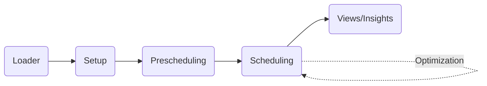
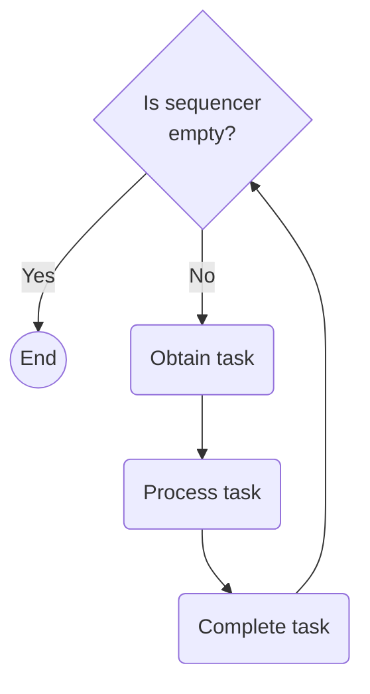

# Design

## Overview

## Scheduling
There are there core components involved at a high-level:
1. Task graph
2. Process handler
3. Sequencer

## FAQs
### How to give input to the data loader?

Every data loader must override load_all() function which requires a parameter `data_files`. It has type **Dict[str, PandasFilePath]**.

We are passing multiple data paths / streams at once because of three reasons:
- A file can be augmented with information from other files in case of incomplete information.
- Sequence of loading files can be different.
- Consistent way to call and use the data loader

Potential problems:
- Passing all data streams at once using a dictionary may cause memory errors.
